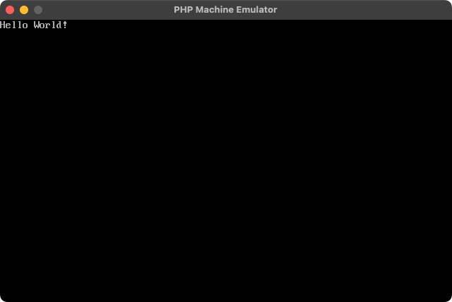
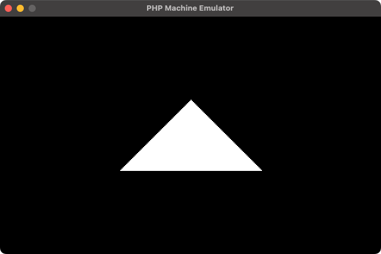
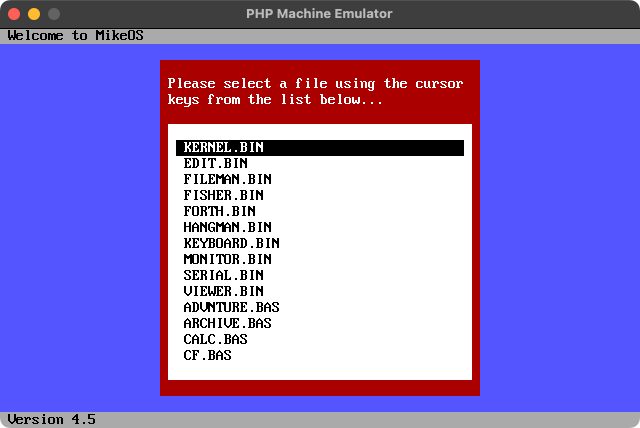
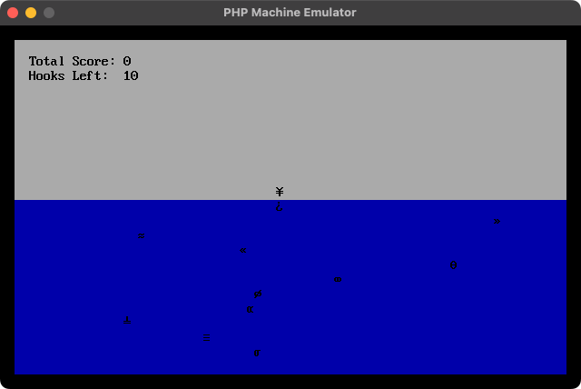
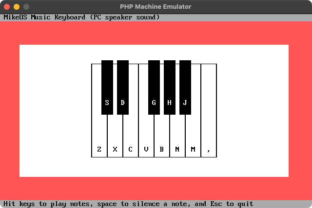
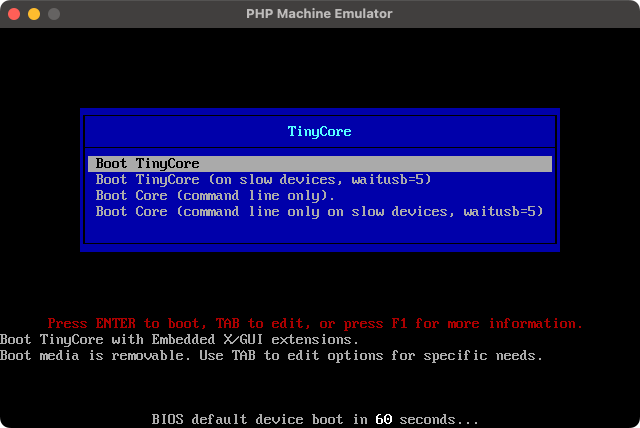
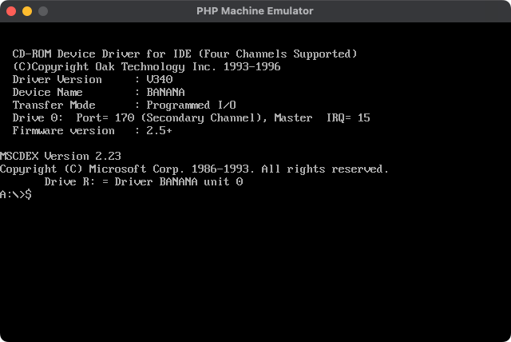

# The PHP machine emulator

The PHP machine emulator is a CPU emulator for Intel x86 written in PHP.
However, since this project is grand in scale, contributions are made by [@m3m0r7](https://github.com/m3m0r7) when they have free time and are motivated.
Since it is written roughly, functionality is not guaranteed.

## Requirements

- PHP 8.3+
- PHP FFI extension enabled (`ffi.enable=1` for CLI)
- NASM
- Rust toolchain (cargo, edition 2021) for the native memory engine
- SDL2 (optional, only for the window renderer)

## Native (Rust) build

This emulator uses a Rust cdylib for the hot path (memory stream + memory accessor).
Build it once per platform and make sure the shared library is present.

```
cd rust
cargo build --release
```

Outputs:
- macOS: `rust/target/release/libphp_machine_emulator_native.dylib`
- Linux: `rust/target/release/libphp_machine_emulator_native.so`
- Windows: `rust/target/release/php_machine_emulator_native.dll`

If you need a custom path, use `RustMemoryStream::setLibraryPath()` in PHP.

## Why Rust is used

The emulator is written in PHP, but a small part is implemented in Rust to keep
performance and memory behavior reasonable for real OS images.

- Memory operations are the hottest path (fetch/decode, read/write, memcpy).
  PHP arrays and zval-heavy structures are too slow and too memory hungry here.
- The Rust memory stream uses sparse page-backed storage. Unwritten pages read as
  zero and pages are allocated only on demand. This avoids huge allocations when
  the guest touches high addresses.
- The Rust memory accessor keeps registers, flags, and control registers in
  fixed-width integers, which makes bit-accurate behavior cheaper than doing
  everything with PHP integers and arrays.
- The boundary is narrow: PHP drives the CPU instruction decoding, devices,
  interrupts, and high-level logic. Rust handles the low-level memory engine
  via a C ABI and PHP FFI calls.

In short, Rust is used only where PHP would otherwise become the bottleneck or
would require excessive memory.

## Native interface details

The Rust library is exposed via a C ABI and loaded through PHP FFI.

Key entry points:
- `src/Stream/RustMemoryStream.php` wraps the Rust memory stream.
- `src/Runtime/RustMemoryAccessor.php` wraps the Rust memory accessor.
- `rust/src/memory_stream.rs` provides sparse page-backed memory.
- `rust/src/memory_accessor.rs` manages registers, flags, and linear/physical
  memory access with fixed-width integers.

There is no pure-PHP fallback for the default runtime. If the Rust library is
missing, runtime initialization will throw. Build the library and ensure FFI is
enabled in PHP.

FFI is also used for the optional SDL2 window renderer.

## Quick start

0. Build the native library (see "Native (Rust) build")

1. Install this project via composer
```
$ composer require m3m0r7/php-machine-emulator
```

2. Make an assembly as `HelloWorld.asm`

```asm
[bits 16]
[org 0x7C00]

main:
  cli
  xor ax, ax
  xor bx, bx
  mov ds, ax
  mov es, ax
  mov ss, ax
  mov sp, 0x7C00
  sti
  mov si, hello_world
  call print_string
hang:
  jmp hang

print_string:
  lodsb
  or al, al
  jz .done
  call .char
  jmp .done
  .char:
    mov ah, 0x0E
    int 0x10
    jmp print_string
  .done:
    ret

hello_world:
  db "Hello World!", 0x0D, 0x0A, 0

times 510-($-$$) db 0
dw 0xAA55
```

3. Assemble the boot sector as a raw binary

```
$ nasm -f bin HelloWorld.asm -o HelloWorld.bin
```

4. Make BIOS starter as `HelloWorld.php`

```php
<?php
require __DIR__ . '/vendor/autoload.php';

use PHPMachineEmulator\ArchitectureType;
use PHPMachineEmulator\BIOS\BIOS;
use PHPMachineEmulator\BootType;
use PHPMachineEmulator\Display\Writer\WindowScreenWriterFactory;
use PHPMachineEmulator\LogicBoard\CPU\CPUContext;
use PHPMachineEmulator\LogicBoard\Display\DisplayContext;
use PHPMachineEmulator\LogicBoard\ExternalDevice\ExternalDeviceContext;
use PHPMachineEmulator\LogicBoard\LogicBoard;
use PHPMachineEmulator\LogicBoard\Media\MediaContext;
use PHPMachineEmulator\LogicBoard\Media\MediaInfo;
use PHPMachineEmulator\LogicBoard\Memory\MemoryContext;
use PHPMachineEmulator\LogicBoard\Network\NetworkContext;
use PHPMachineEmulator\LogicBoard\Storage\StorageContext;
use PHPMachineEmulator\LogicBoard\Storage\StorageInfo;
use PHPMachineEmulator\Machine;
use PHPMachineEmulator\Stream\FileBootStream;
use PHPMachineEmulator\Stream\FileStream;

$bootStream = new FileBootStream(new FileStream(__DIR__ . '/HelloWorld.bin'));

$logicBoard = new LogicBoard(
    memoryContext: new MemoryContext(),
    cpuContext: new CPUContext(architectureType: ArchitectureType::Intel_x86),
    networkContext: new NetworkContext(),
    displayContext: new DisplayContext(new WindowScreenWriterFactory()),
    storageContext: new StorageContext(new StorageInfo(0x10000)),
    mediaContext: new MediaContext(new MediaInfo($bootStream, BootType::BOOT_SIGNATURE)),
    externalDeviceContext: new ExternalDeviceContext(),
);

$machine = new Machine($logicBoard);

try {
    BIOS::start(
        $machine->runtime(BIOS::BIOS_ENTRYPOINT),
        $machine->logicBoard()->media(),
        $machine->option(),
    );
} catch (\PHPMachineEmulator\Exception\ExitException $e) {
    exit($e->getCode());
}
```

5. Let's emulating CPU as following:

```
$ php HelloWorld.php
```

6. It is shown as following:

```
Hello World!
```



# Render a triangle via the VIDEO mode

For an example; You can render a pixel art from a bootloader as following:

1. Write an assembly and save as `Triangle.asm`

```asm
[bits 16]
[org 0x7c00]

SCREEN_WIDTH equ 320
TRI_CENTER_X equ 160
TRI_TOP equ 70
TRI_HEIGHT equ 60

main:
  ; Setup segments
  cli
  xor ax, ax
  xor bx, bx
  mov ds, ax
  mov es, ax
  mov ss, ax

  ; Set the video mode with BIOS interrupt
  mov ah, 0x00
  mov al, 0x13
  int 0x10

  ; Move to the video memory
  mov ax, 0xA000
  mov es, ax
  cld

  ; Clear screen (320x200)
  xor di, di
  xor ax, ax
  mov cx, 0xFA00
  rep stosb

  ; Draw a centered triangle (size via TRI_* constants)
  mov di, (TRI_TOP * SCREEN_WIDTH) + TRI_CENTER_X
  mov dx, 1          ; width
  mov bx, TRI_HEIGHT ; height
  mov al, 0x0f       ; white

draw_row:
  mov cx, dx
  rep stosb

  ; Move to next row and shift left by 1 (keep AL as color)
  add di, SCREEN_WIDTH - 1
  sub di, dx

  add dx, 2
  dec bx
  jnz draw_row

hang:
    jmp hang

; Pad to 510 bytes and add boot signature
times 510-($-$$) db 0
dw 0xAA55
```

2. Assemble the boot sector as a raw binary

```
$ nasm -f bin Triangle.asm -o Triangle.bin
```

3. Write a PHP and save as `Triangle.php`

```php
<?php
require __DIR__ . '/vendor/autoload.php';

use PHPMachineEmulator\ArchitectureType;
use PHPMachineEmulator\BIOS\BIOS;
use PHPMachineEmulator\BootType;
use PHPMachineEmulator\Display\Writer\WindowScreenWriterFactory;
use PHPMachineEmulator\LogicBoard\CPU\CPUContext;
use PHPMachineEmulator\LogicBoard\Display\DisplayContext;
use PHPMachineEmulator\LogicBoard\ExternalDevice\ExternalDeviceContext;
use PHPMachineEmulator\LogicBoard\LogicBoard;
use PHPMachineEmulator\LogicBoard\Media\MediaContext;
use PHPMachineEmulator\LogicBoard\Media\MediaInfo;
use PHPMachineEmulator\LogicBoard\Memory\MemoryContext;
use PHPMachineEmulator\LogicBoard\Network\NetworkContext;
use PHPMachineEmulator\LogicBoard\Storage\StorageContext;
use PHPMachineEmulator\LogicBoard\Storage\StorageInfo;
use PHPMachineEmulator\Machine;
use PHPMachineEmulator\Stream\FileBootStream;
use PHPMachineEmulator\Stream\FileStream;

$bootStream = new FileBootStream(new FileStream(__DIR__ . '/Triangle.bin'));

$logicBoard = new LogicBoard(
    memoryContext: new MemoryContext(),
    cpuContext: new CPUContext(architectureType: ArchitectureType::Intel_x86),
    networkContext: new NetworkContext(),
    displayContext: new DisplayContext(new WindowScreenWriterFactory()),
    storageContext: new StorageContext(new StorageInfo(0x10000)),
    mediaContext: new MediaContext(new MediaInfo($bootStream, BootType::BOOT_SIGNATURE)),
    externalDeviceContext: new ExternalDeviceContext(),
);

$machine = new Machine($logicBoard);

try {
    BIOS::start(
        $machine->runtime(BIOS::BIOS_ENTRYPOINT),
        $machine->logicBoard()->media(),
        $machine->option(),
    );
} catch (\PHPMachineEmulator\Exception\ExitException $e) {
    exit($e->getCode());
}
```

4. Run an emulator

```
$ php Triangle.php
```
5. You will get result as following:



# Tests

```
./vendor/bin/phpunit --bootstrap ./tests/Bootstrap.php tests/Case
```

# Boot targets

## MikeOS

Space for tracking the MikeOS boot/run status.





## TinyCore

*Note: Reaching the boot menu takes about 5 minutes.*



## MS-DOS



## Ubuntu

Space for tracking the Ubuntu GRUB boot status.

*Note: Reaching GRUB may take 15-20 minutes.*


# LICENSE
MIT
