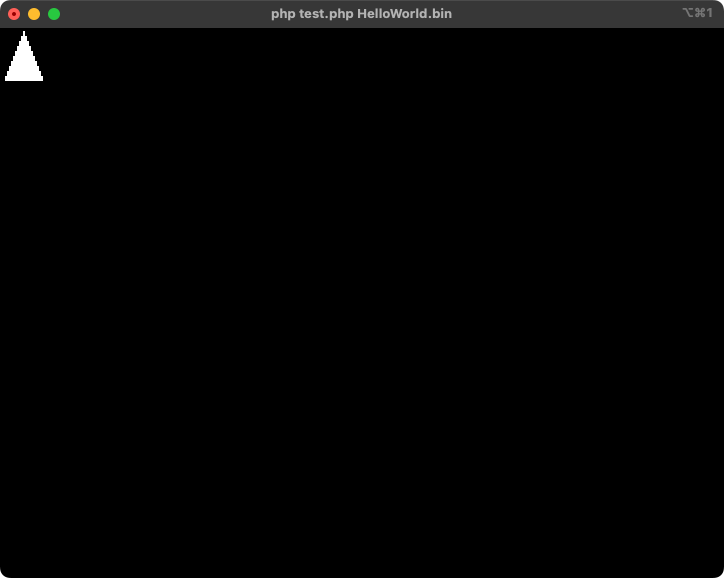

# The PHP machine emulator

The PHP machine emulator is a CPU emulator for Intel x86 written in PHP.
However, since this project is grand in scale, contributions are made by [@m3m0r7](https://github.com/m3m0r7) when they have free time and are motivated.
Since it is written roughly, functionality is not guaranteed.

## Requirements

- PHP 8.3+
- NASM

## Quick start

1. Install this project via composer
```
$ composer require m3m0r7/php-machine-emulator
```

2. Make an assembly as `HelloWorld.asm`

```asm
[bits 16]
[org 0x7C00]

main:
  cli
  xor ax, ax
  xor bx, bx
  mov ds, ax
  mov es, ax
  mov ss, ax
  mov sp, 0x7C00
  sti
mov si, hello_world
call print_string
hlt

print_string:
  lodsb
  or al, al
  jz .done
  call .char
  jmp .done
  .char:
    mov ah, 0x0E
    int 0x10
    jmp print_string
  .done:
    ret

hello_world:
  db "Hello World!", 0x0D, 0x0A, 0

times 510-($-$$) db 0
dw 0xAA55
```

3. Make BIOS Starter as a `HelloWorld.php`

```php
<?php
require __DIR__ . '/vendor/autoload.php';

try {
    \PHPMachineEmulator\BIOS::start(
        new \PHPMachineEmulator\Stream\InputPipeReaderStream(),
    );
} catch (\PHPMachineEmulator\Exception\ExitException $e) {
    exit($e->getCode());
}
```

4. Let's emulating CPU as following:

```
$ nasm HelloWorld.asm -o /dev/stdout | php HelloWorld.php
```

5. It is shown as following:

```
Hello World!
```

# Render a triangle via the VIDEO mode

For an example; You can render a pixel art from a bootloader as following:

1. Write an assembly and save as `Triangle.asm`

```
[bits 16]
[org 0x7C00]

main:
  ; Setup segments
  cli
  xor ax, ax
  xor bx, bx
  mov ds, ax
  mov es, ax
  mov ss, ax
  mov sp, 0x7C00

  ; Set the video mode with BIOS interrupt
  mov ah, 0x00
  mov al, 0x13
  int 0x10

  ; Move to the video memory
  mov ax, 0xA000
  mov es, ax
  xor di, di

  ; Set triangle memory  to the source index
  mov si, triangle

  ; Looping for rows
  mov cx, 10
draw_row:
  ; Push for rows size
  push cx

  ; Looping for cols
  mov cx, 19

draw_pixel:
  ; Load a byte from source index
  lodsb
  cmp al, 0xff
  jne save_pixel

  ; Specify render color - white
  mov al, 0x0f

save_pixel:
  ; Save to ES:DI register from AL register value
  stosb

skip_pixel:
  mov al, 0x00
  loop draw_pixel

  ; Rollback looping rows size to CX register
  pop cx

  ; Move to next line (i.e., Video Width)
  add di, 320-19

  loop draw_row

; Infinity loop
hang:
    jmp hang

; 0x00 - no available to render a pixel (filling by black)
; 0xFF - render a pixel (filling by white)
triangle:
  db 0x00, 0x00, 0x00, 0x00, 0x00, 0x00, 0x00, 0x00, 0x00, 0xFF, 0x00, 0x00, 0x00, 0x00, 0x00, 0x00, 0x00, 0x00, 0x00
  db 0x00, 0x00, 0x00, 0x00, 0x00, 0x00, 0x00, 0x00, 0xFF, 0xFF, 0xFF, 0x00, 0x00, 0x00, 0x00, 0x00, 0x00, 0x00, 0x00
  db 0x00, 0x00, 0x00, 0x00, 0x00, 0x00, 0x00, 0xFF, 0xFF, 0xFF, 0xFF, 0xFF, 0x00, 0x00, 0x00, 0x00, 0x00, 0x00, 0x00
  db 0x00, 0x00, 0x00, 0x00, 0x00, 0x00, 0xFF, 0xFF, 0xFF, 0xFF, 0xFF, 0xFF, 0xFF, 0x00, 0x00, 0x00, 0x00, 0x00, 0x00
  db 0x00, 0x00, 0x00, 0x00, 0x00, 0xFF, 0xFF, 0xFF, 0xFF, 0xFF, 0xFF, 0xFF, 0xFF, 0xFF, 0x00, 0x00, 0x00, 0x00, 0x00
  db 0x00, 0x00, 0x00, 0x00, 0xFF, 0xFF, 0xFF, 0xFF, 0xFF, 0xFF, 0xFF, 0xFF, 0xFF, 0xFF, 0xFF, 0x00, 0x00, 0x00, 0x00
  db 0x00, 0x00, 0x00, 0xFF, 0xFF, 0xFF, 0xFF, 0xFF, 0xFF, 0xFF, 0xFF, 0xFF, 0xFF, 0xFF, 0xFF, 0xFF, 0x00, 0x00, 0x00
  db 0x00, 0x00, 0xFF, 0xFF, 0xFF, 0xFF, 0xFF, 0xFF, 0xFF, 0xFF, 0xFF, 0xFF, 0xFF, 0xFF, 0xFF, 0xFF, 0xFF, 0x00, 0x00
  db 0x00, 0xFF, 0xFF, 0xFF, 0xFF, 0xFF, 0xFF, 0xFF, 0xFF, 0xFF, 0xFF, 0xFF, 0xFF, 0xFF, 0xFF, 0xFF, 0xFF, 0xFF, 0x00
  db 0xFF, 0xFF, 0xFF, 0xFF, 0xFF, 0xFF, 0xFF, 0xFF, 0xFF, 0xFF, 0xFF, 0xFF, 0xFF, 0xFF, 0xFF, 0xFF, 0xFF, 0xFF, 0xFF

times 510-($-$$) db 0
dw 0xAA55
```

2. Write a PHP and save as `Triangle.php`

```
<?php
require __DIR__ . '/vendor/autoload.php';

try {
    \PHPMachineEmulator\BIOS::start(
        new \PHPMachineEmulator\Stream\InputPipeReaderStream(),
    );
} catch (\PHPMachineEmulator\Exception\ExitException $e) {
    exit($e->getCode());
}
```

3. Compile with NASM and run an emulator

```
$ nasm Triangle.asm -o /dev/stdout | php Triangle.php
```

_NOTICE: You should expand your terminal 320x200 (Cols and Rows) in a default example assembly._
_But it is too big terminal size. Maybe you need to zoom out (`Cmd` + `-` in macOS) fully and using iTerm is better to render beautifully at currently._


4. You will get result as following:
<p align="center">
  
</p>

# Tests

```
./vendor/bin/phpunit --bootstrap ./tests/Bootstrap.php tests/Case
```

# LICENSE
MIT
